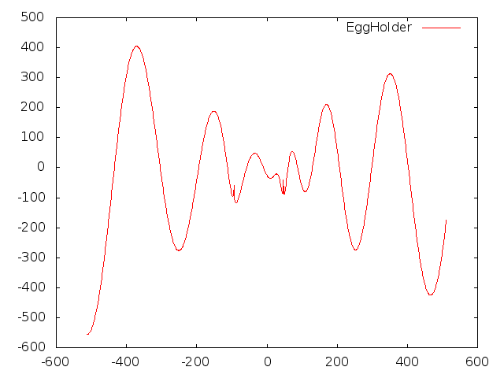

001-function
============

Welcome to RobOptim 101!

The goal of this exercise is to write your first RobOptim function.

The EggHolder function
----------------------

The EggHolder function is typically used to test numerical
optimization software due to its numerous local minimal. In 2d, it can
be represented as follow:

To simplify the implementation and display, we will just implement a
1D Egg-Holder function.

The formula of this function is:

[Figure and formula from Wikipedia][test_functions]

Display the function using the RobOptim Gnuplot tools
-----------------------------------------------------

Using the skeleton in the file 001-function.cc, implement the
function.

You should use the RobOptim Gnuplot visualization tools to plot the
function on the *standard output*.

Finally, running the command:

    ./001-function | gnuplot

...should display the following graph:

To help you:

 * [RobOptim Core documentation][roboptim_core]

[Home][main] | [Next →][ex2]

 [main]: https://github.com/roboptim/roboptim-tutorial/
 [ex2]: https://github.com/roboptim/roboptim-tutorial/tree/master/src/002-operator

 [test_functions]: http://en.wikipedia.org/wiki/Test_functions_for_optimization
 [roboptim_core]: http://www.roboptim.net/roboptim-core/doxygen/HEAD/
