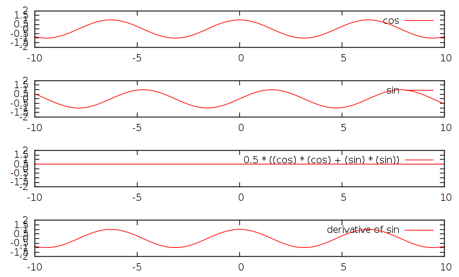

002-filter
==========

Filters are RobOptim tools that allow you to combine functions together.

Let's use some of the built-in RobOptim filters to manipulate basic functions!

Built-in Functions
------------------

Look into the `include/roboptim/core/function` directory of `roboptim-core`.

You will see than RobOptim bundles some basic functions, including:

* Cosinus
* Sinus
* Constant
* Identity
* Polynomial

First, try to instantiate a Cos and Sin function. Display their value
to make sure that you obtain what you expect.

Instead of instantiating them on the stack, create a shared pointer
pointing to these classes.

*Reminder:* the correct way to instantiate shared pointers is:

    #include <boost/make_shared.hpp>
    boost::shared_ptr<SOME_TYPE> fPtr = boost::make_shared<SOME_TYPE> (ARG0, ARG1, ...);

Basic Filters
-------------

* `f + g`
* `f - g`
* `λ f`
* `f * g`
* `g ∘ f` (function composition)
* `f'` (derivation)

Manipulating functions
----------------------

You already instantiated Cosinus and Sinus functions as shared
pointers previously. Now, try to combine the two functions as follow:

You should end up with a new function object.

Additionally, use the derivative filter on sinus and display the
result.

Use the Gnuplot visualization tools so that running the command:

    ./002-filter | gnuplot

...display the following graphs:

[← Prev][ex1] | [Home][main] | [Next →][ex3]

 [main]: https://github.com/roboptim/roboptim-tutorial/
 [ex1]: https://github.com/roboptim/roboptim-tutorial/tree/master/src/001-function
 [ex3]: https://github.com/roboptim/roboptim-tutorial/tree/master/src/003-hs71
