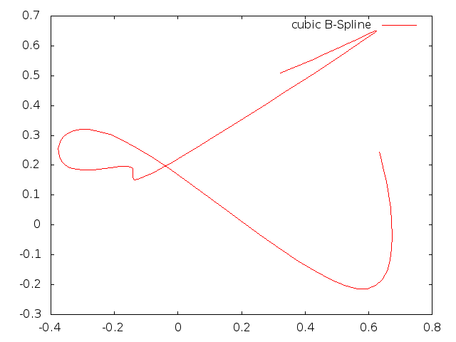

004-bspline
===========

RobOptim trajectory provides parametrized curve which parameters can
later be optimized.

First, let's try to create a cubic B-Spline using RobOptim Trajectory.
The spline should be defined from `t = 0` to `t = 10`. Parameters can
be chosen randomly.

Display it using the visualization tools.

Once this is done, create a free time trajectory from this
trajectory. Free time trajectory allows to change the time
parametrization of a curve.

Display the following trajectory values:

* original spline, `t = 5`
* free time trajectory, `scale = 1`, `t = 5`

RobOptim Trajectory also provides points moving with the time
parametrization. They are called "stable time point". Display the
following information:

* original spline `stp = .5`
* free time trajectory `stp = .5`

In the end, running `004-bspline | gnuplot` shoud give you:

*Note:* the trajectory will change depending on your initial
 parameters.

[← Prev][ex3] | [Home][main] | [Next →][ex5]

 [main]: https://github.com/roboptim/roboptim-tutorial/
 [ex3]: https://github.com/roboptim/roboptim-tutorial/tree/master/src/003-hs71
 [ex5]: https://github.com/roboptim/roboptim-tutorial/tree/master/src/005-trajectory-optimization
